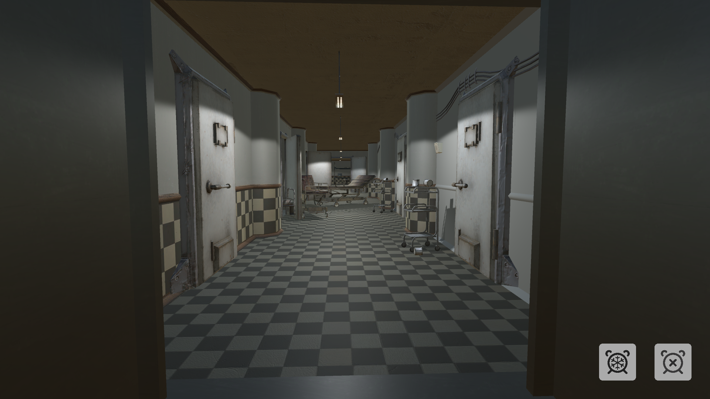

# PokAPI
<mark>NOT FINALIZED<mark>

## Overview
Welcome to AEON, where time becomes both a friend and a foe. AEON, derived from "A long, indefinite period of time," encapsulates the essence of our protagonist's predicament. Trapped in an endless time loop, our character must navigate a world filled with puzzles, challenges, and leaps through temporal dimensions.
> Final Examination for the Game or Simulation Programming Course (420-5PJ-AA / Autumn 2023). Conditions: 10 weeks in group of 4, for completion.

## Table of Contents
- [Features](#features)
- [The Antagonist: Kronos](#the-antagonist-kronos)
- [Endless Loop, Evolving Challenges](#endless-loop-evolving-challenges)
- [Technologies Used](#technologies-used)
- [Demo](#demo)
- [Getting Started](#getting-started)
- [License](#license)

## Features

- **Temporal Abilities**: AEON possesses two unique powers - the ability to stop time and to slow it down. These powers are crucial for solving puzzles and overcoming obstacles in the game world.

- **Ingenious Puzzles**: Navigate through a series of mind-bending puzzles that require clever use of time manipulation to progress. Each challenge pushes your understanding of temporal mechanics to the limit.

- **Temporal Jumps**: Master the art of temporal jumps to traverse the game world. Leap through time and space, overcoming obstacles and exploring different facets of the environment.

## The Antagonist: Kronos

Beware of Kronos, the god of time, who harbors a strong disapproval of tampering with temporal realities. Kronos lurks, ready to seize anyone daring to play with the fabric of time. Using the power to stop time attracts his attention, leading to a reset of the game back to its initial state.

## Endless Loop, Evolving Challenges

The entire game unfolds within a single level, creating a unique and cyclical experience. As you progress and reach the end, the challenges become more intricate, requiring heightened mastery of temporal abilities. Each completion takes you back to the beginning, but the journey is never the same, with increased complexity and new obstacles to overcome.

## Technologies Used

- **C#**: The core programming language driving the server-side logic, handling backend operations, and implementing dynamic functionalities.

- **Unity**: A powerful game development engine used to create immersive and interactive experiences, providing a comprehensive framework for game design and implementation.

- **Rider**: The JetBrains IDE of choice for C# development in this project. Rider offers a seamless and efficient coding environment, enhancing the development workflow with its robust set of features and tools.

## Demo

## Getting Started

1. Clone the repository: `git clone https://github.com/MaxenceGuidezCollege/AEON.git`
2. Open the project in Unity 2022.3.17f1 (or the latest update).
3. Once the project is fully loaded, build it using Ctrl + B.
4. Explore and immerse yourself in the world and story of AEON!

## License

This project was made by a group of 4 contributors. The contributors to this project are:

- Antoine Gagnon
- Migaël Beaudoin
- Jérôme Lavoie
- Maxence Guidez

This project is licensed under the MIT License - see the [LICENSE.md](LICENSE.md) file for details.